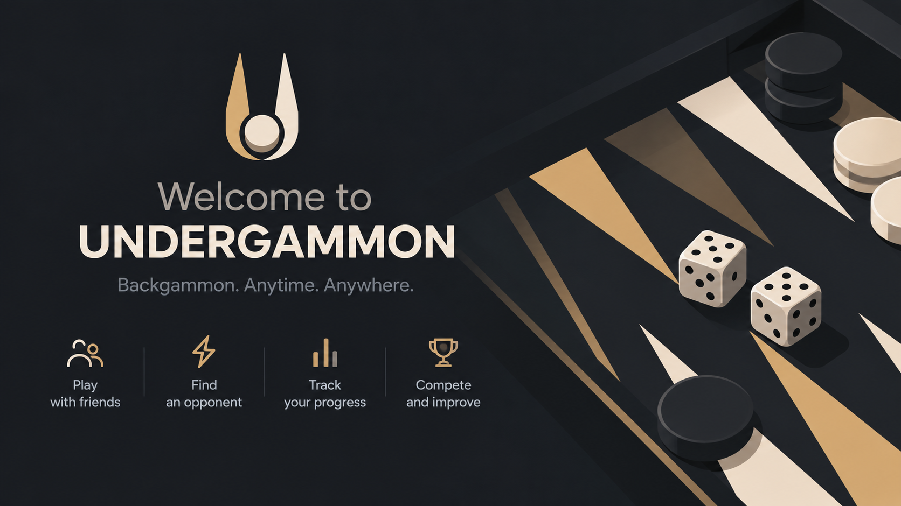
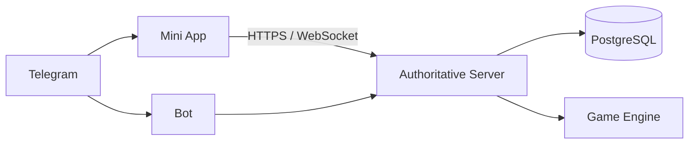

# UNDERGAMMON

**Telegram-first online Long Nardy and Classic Backgammon with server-authoritative realtime multiplayer.**

Season 0 is a persistent Open Beta. The game is live in production and playable through Telegram.

[Open in Telegram](https://t.me/UndergammonBot) · [Production](https://undergammon.tracerxbrhd.ru) · [Documentation](docs/README.md)

[](https://github.com/tracerxbrhd/undergammon/actions/workflows/ci.yml)


## About

UNDERGAMMON is an online backgammon project built around Telegram. The Telegram Bot is the entry point for launching the game, invites and notifications; the Telegram Mini App is the primary game client; the backend owns accounts, matchmaking, realtime sessions and authoritative gameplay.

The project currently focuses on delivering a reliable Telegram game rather than a general-purpose gaming platform. Long Nardy and Classic Backgammon rules live in a deterministic shared game engine, while dice, move validation, match state, results, progression and economy remain authoritative on the server.

## What works today

The current production build includes:

- Telegram `initData` authentication and internal Game Accounts;
- Long Nardy and Classic Backgammon PvP;
- server-authoritative dice, move validation, match state and results;
- casual matchmaking and private challenge/invite flows;
- realtime gameplay with reconnect and restart recovery;
- profiles, Season 0 ratings, leaderboards, XP/level and match history;
- earned Coins, ranked rewards and a 7-day Daily Reward;
- permanent cosmetic ownership and equipment;
- Season 0 Tester and Bronze Profile Frames;
- Store -> purchase -> Cosmetics -> equip -> Profile presentation flow;
- RU/EN player-facing flows;
- Docker Compose production deployment with PostgreSQL persistence and Caddy/HTTPS.

For the exact implementation snapshot, known technical debt and accepted deferrals, see [IMPLEMENTATION_STATUS.md](IMPLEMENTATION_STATUS.md).

## Architecture at a glance



Primary stack: **TypeScript · React · Node.js · Fastify · WebSocket · PostgreSQL · Docker Compose**.

The current production topology is intentionally simple: one VPS, one backend/realtime process and PostgreSQL. Redis, queues, microservices and multi-replica realtime are not part of the current architecture.

## Repository structure

```text
apps/
  bot/          Telegram Bot
  miniapp/      Telegram Mini App client
  server/       HTTP, realtime and authoritative application backend

packages/
  game-engine/  deterministic Long Nardy / Backgammon rules
  protocol/     shared validated application and realtime contracts

docs/           product, architecture and engineering documentation
infra/          production infrastructure configuration
tests/          repository-level browser tests
```

The frozen `tracerxbrhd/backgammon` repository is legacy/reference material only. UNDERGAMMON does not inherit its repository architecture.

## Development

Requirements: Node 24, pnpm 12.4.1 and Docker Compose 2.24.4 or newer.

```sh
npm install --global pnpm@12.4.1
pnpm install --frozen-lockfile
pnpm build
pnpm test
```

Local Telegram authentication deliberately has no development bypass. Full setup, isolated PostgreSQL test database instructions, browser testing and verification commands are documented in [docs/development/README.md](docs/development/README.md).

Production deployment, webhook setup, migrations and backup/restore procedures are documented separately in [docs/operations/README.md](docs/operations/README.md).

## Documentation

Start with [docs/README.md](docs/README.md).

- [Product decisions](docs/product/) define accepted product behavior.
- [Architecture decisions](docs/architecture/) define the technical contracts and deployment model.
- [Development guide](docs/development/README.md) covers local setup and verification.
- [Operations guide](docs/operations/README.md) covers the current production runbook.
- [Implementation status](IMPLEMENTATION_STATUS.md) records what is deployed, partial and intentionally deferred.
- [AGENTS.md](AGENTS.md) contains repository guidance for coding agents.

Historical execution prompts are archived under `docs/archive/` and are not current product or architecture authority.

## Security and contributing

Security-sensitive reports should follow [SECURITY.md](SECURITY.md). Do not publish credentials, Telegram `initData`, session tokens, private user data or exploit details in public issues.

External contributions are handled through pull requests under the terms in [CONTRIBUTING.md](CONTRIBUTING.md).

## License

This repository is **public-source proprietary software, not open source**. Source availability permits inspection and study but does not grant permission to reuse, redistribute or create derivative products. See [LICENSE](LICENSE) for the source notice and applicable terms.
